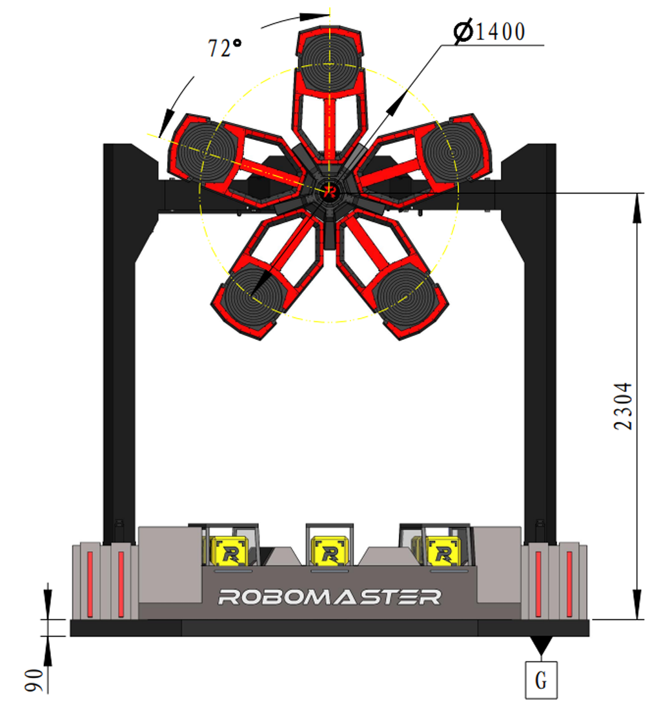
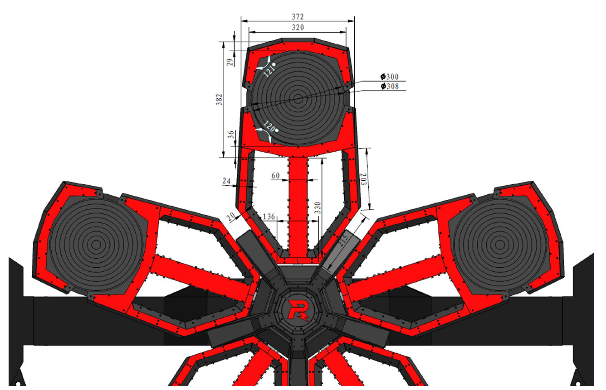
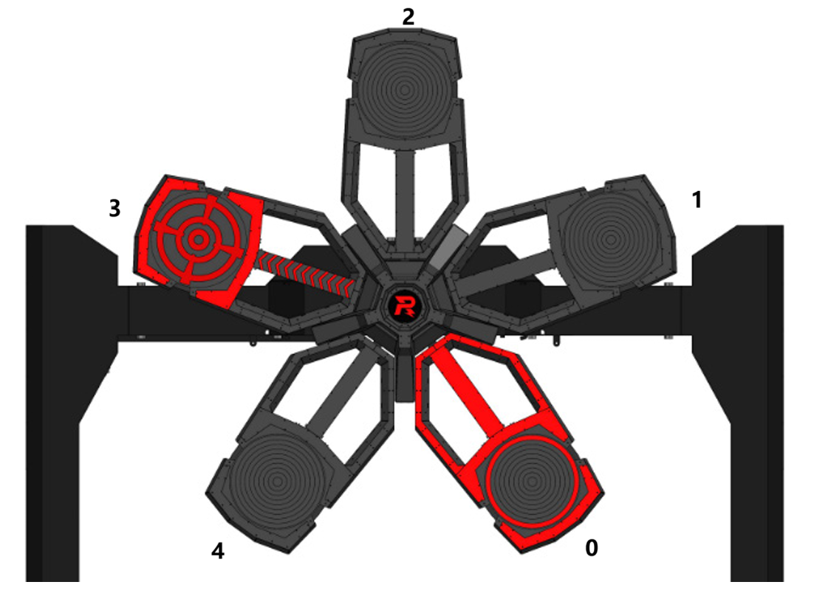

# 2024 Energy Gain

## 写在前面

作者对2024赛季的能量机关自动瞄准的研发从2023年11月开始，陆续完成一部分预研，2024年1月基本完成能量机关扇叶识别与小能量机关的跟踪，2024年4月完成大能量机关的跟踪。本项目基于 [FaterYU/rm_vision (github.com)](https://github.com/FaterYU/rm_vision) 框架开发，部分研发思路参考了 [FaterYU/rm_auto_aim (github.com)](https://github.com/FaterYU/rm_auto_aim) 的思路。本模块还有诸多可改进的细节，但苦于战队其他部分进度爆炸，也仅能停滞于此，计划于本赛季结束将本模块开源。开源此项目希望能有更多队伍不拘泥于在像素坐标下进行运动跟踪，参考本项目的方案开源对能量机关进行“整符观测跟踪”，同时也希望能为的能量机关自动瞄准开源添砖加瓦 。此外本模块与 [FaterYU/rm_auto_aim (github.com)](https://github.com/FaterYU/rm_auto_aim) 高度适配，同时也易于与 `rm_vision` 其他模块解耦。

由于实现过程存在不少个人考量与细节操作，本文档仅描述整体思路实现，具体实现细节建议阅读本文档后通读源码。各部分文档也会陆续完善，同时欢迎提PR补充一起补充完善此项目。

## 测试环境

- 上位机
  - Intel i7-1165G7
  - Ubuntu 22.04
  - OpenCV 4.5.3
  - ROS 2 Humble
  - Openvino 2024.1
  - Hikvision MV-CA016-10UC
  - 8mm 镜头
- 下位机
  - RoboMaster C型开发板

## 任务概述

> [RoboMaster 2024机甲大师超级对抗赛比赛规则手册V1.2](https://terra-1-g.djicdn.com/b2a076471c6c4b72b574a977334d3e05/RM2024/RoboMaster%202024%20机甲大师超级对抗赛比赛规则手册V1.2（20240411）.pdf)
>
> 以下仅列出部分内容，具体描述请详细阅读规则

### 基础规则

能量机关位于大资源岛正上方。能量机关由电机驱动并按照一定规律同步转动。机器人需占领能量机关激
活点以激活能量机关。能量机关分为红蓝两侧，一侧为红方能量机关，另一侧为蓝方能量机关。能量机关有5个均匀分布的支架，具体位置和尺寸如下所示：

|  |  |
| :---------------------------------------------: | :--------------------------------------------------------------: |
|                 能量机关示意图                  |                      能量机关支架尺寸示意图                      |

- **小能量机关**：比赛开始1分钟后和比赛开始2分30秒后（即倒计时为5:59和4:29），能量机关开始
  旋转，进入可激活状态，能量机关进入可激活状态30 秒后，若其仍未被激活，则将恢复为不可激活
  状态。
- **大能量机关**：比赛开始4分钟、5分15秒、6分30秒后（即倒计时2:59、1:44、0:29），能量机关
  开始旋转，进入可激活状态，能量机关进入可激活状态 30 秒后，若其仍未被激活，则将恢复为不可
  激活状态。大能量机关的每块装甲模块被划分为1~10环。一方机器人激活大能量机关后，系统将根
  据其击中的总环数为该方所有机器人提供相应的攻击和防御增益。

### 能量机关的旋转策略

- 红蓝双方能量机关共轴旋转，即红方能量机关顺时针旋转时，蓝方能量机关相应地逆时针旋转（旋转方向以面朝该方能量机关时的旋转方向进行确定）。每局比赛开始前，能量机关旋转方向随机。该局比赛中，能量机关旋转方向保持一致。
- 小能量机关的转速固定为 $1/3π rad/s$ 。
- 大能量机关转速按照三角函数呈周期性变化。速度目标函数为： $spd=a \cdot sin(\omega \cdot 𝑡)+𝑏$ ，其中 spd的单位为 $rad/s$ ， $t$ 的单位为 $s$ ， $a$ 的取值范围为 $0.780 \sim 1.045$ ， $ω$ 的取值范围为 $1.884 \sim 2.000$ ， $b$ 始终满足 $b=2.090-a$ 。每次大能量机关进入可激活状态时，所有参数重置，其中 $t$ 重置为 $0$ ， $a$ 和 $ω$ 重置为取值范围内任意值。
- 能量机关的实际转速与速度目标函数的时间误差在 $500ms$ 内。

## 符号定义

|    符号     |          变量名称          |                      备注                      |
| :---------: | :------------------------: | :--------------------------------------------: |
|    $x_k$    |   $k$ 时刻的能量机关状态   |                                                |
|    $z_k$    |   $k$ 时刻的能量机关观测   |                                                |
| $\hat{x}_k$ | $k$ 时刻的能量机关状态估计 |                                                |
|    $x_c$    |   能量机关中心 $x$ 坐标    |                      (m)                       |
|    $y_c$    |   能量机关中心 $y$ 坐标    |                      (m)                       |
|    $z_c$    |   能量机关中心 $z$ 坐标    |                      (m)                       |
|   $v_x^c$   | 能量机关中心 $x$ 方向速度  |                     (m/s)                      |
|   $v_y^c$   | 能量机关中心 $y$ 方向速度  |                     (m/s)                      |
|   $v_z^c$   | 能量机关中心 $z$ 方向速度  |                     (m/s)                      |
|     $r$     |        能量机关半径        |                      (m)                       |
|  $\theta$   |        能量机关角度        | 以初次跟踪扇叶角度作为能量机关的起始角度 (rad) |
|  $\omega$   |       能量机关角速度       |                    (rad/s)                     |
|    $x_b$    |   能量机关扇叶 $x$ 坐标    |                      (m)                       |
|    $y_b$    |   能量机关扇叶 $y$ 坐标    |                      (m)                       |
|    $z_b$    |   能量机关扇叶 $z$ 坐标    |                      (m)                       |
|     $t$     |            时间            |                      (s)                       |
| $\Delta{t}$ |     两次观测的时间间隔     |                      (s)                       |
|     $a$     |     大能量机关参数 $a$     |                                                |
|     $b$     |     大能量机关参数 $b$     |                                                |
|     $c$     |     大能量机关参数 $c$     |                                                |
|     $w$     |     大能量机关参数 $w$     |                                                |
|     $F$     | 扩展卡尔曼滤波状态转移矩阵 |                                                |
|     $P$     |  扩展卡尔曼滤波协方差矩阵  |                                                |
|     $H$     |   扩展卡尔曼滤波观测矩阵   |                                                |
|     $K$     |   扩展卡尔曼滤波增益矩阵   |                                                |
|     $Q$     | 扩展卡尔曼滤波过程噪声矩阵 |                                                |
|     $R$     | 扩展卡尔曼滤波观测噪声矩阵 |                                                |

## 任务分析

TBD

## 相机标定

采用张友正标定法进行相机标定，具体操作参考：[camera_calibration_parsers - ROS Wiki](http://wiki.ros.org/camera_calibration_parsers)

## 能量机关扇叶识别

使用西交利物浦GMaster战队开源数据集：[YOLO-of-RoboMaster-Keypoints-Detection-2023](https://github.com/zRzRzRzRzRzRzR/YOLO-of-RoboMaster-Keypoints-Detection-2023)，网络结构使用[Pose - Ultralytics YOLOv8 Docs](https://docs.ultralytics.com/tasks/pose/)，具体模型训练调参流程见：[FaterYU/rm_buff at train (github.com)](https://github.com/FaterYU/rm_buff/tree/train)，此外作者仅对模型进行了量化，若对实时性有更大的需求可对其做半精度

得到模型后使用 `openvino` 进行推理，为节省环境配置时间，ROS2 humble + Openvino2024 的Docker环境作者已进行预先构建：[fateryu/ros2_humble_openvino general | Docker Hub](https://hub.docker.com/repository/docker/fateryu/ros2_humble_openvino/general)

由于战队自制能量机关的匀光过于抽象以及识别效果没有调教的很好，因此在神经网络识别后对ROI进行了部分传统视觉矫正，具体推理与矫正流程参考[buff_detector/src/detetor.cpp](../buff_detector/src/detector.cpp)，在此不过多赘述。

接着对识别到的扇叶进行PnP解算，得到扇叶的三维坐标：[Perspective-n-Point (PnP) pose computation](https://docs.opencv.org/4.x/d5/d1f/calib3d_solvePnP.html)

考虑到能量机关扇叶的四个点在一个平面上，在PnP解算方法上同样选择 `cv::SOLVEPNP_IPPE` (Method is based on the paper of T. Collins and A. Bartoli. ["Infinitesimal Plane-Based Pose Estimation"](https://link.springer.com/article/10.1007/s11263-014-0725-5). This method requires coplanar object points.)

## 相机坐标系到odom坐标系的转换

通过下位机获取的imu姿态及机器人odom到相机坐标系的变化进行tf变化，得到能量机关扇叶在odom坐标系下的位姿信息

## 由跳变扇叶到能量机关

能量机关在共有5个扇叶，在旋转过程中会随机出现扇叶的跳变，为了对能量机关整体进行状态估计，需要将扇叶的跳变抵消，并将扇叶状态转换为能量机关的状态。由于能量机关扇叶之间的夹角是固定的，考虑将第一个识别的扇叶作为能量机关的起始扇叶，后续识别到的扇叶均通过跳变夹角旋转计算出当前时刻第一个扇叶的位置，然后通过扇叶的位置计算出能量机关中心的位置。为此，需要维护一个扇叶编号变量 `blade_id` 用于记录当前时刻识别的扇叶相对于第一个扇叶的编号，示意图如下：

## 能量机关跟踪

### 能量机关扩展卡尔曼滤波定义

由于能量机关的运动观测空间到状态空间的转换是非线性的，因此使用扩展卡尔曼滤波进行状态估计。

状态空间：

$$
x_k=\begin{bmatrix}
x_c   \\
y_c \\
z_c \\
v_x^c \\
v_y^c \\
v_z^c \\
r \\
\theta \\
\omega \\
\end{bmatrix}
$$

观测空间：

$$
z_k=\begin{bmatrix}
x_b   \\
y_b \\
z_b \\
\theta
\end{bmatrix}
$$

状态外插关系：

$$
f(\cdot)=\begin{cases}
x_c=x_c+v_x^c \Delta{t}     \\
   y_c=y_c+v_y^c \Delta{t}     \\
z_c=z_c+v_z^c \Delta{t}     \\
\theta=\theta+\omega \Delta{t}     \\
\end{cases}
$$

状态转移矩阵：

$$
F=\begin{bmatrix}
1 & 0 & 0 & \Delta{t} & 0 & 0 & 0 & 0 & 0   \\
0 & 1 & 0 & 0 & \Delta{t} & 0 & 0 & 0 & 0   \\
0 & 0 & 1 & 0 & 0 & \Delta{t} & 0 & 0 & 0   \\
0 & 0 & 0 & 1 & 0 & 0 & 0 & 0 & 0   \\
0 & 0 & 0 & 0 & 1 & 0 & 0 & 0 & 0   \\
0 & 0 & 0 & 0 & 0 & 1 & 0 & 0 & 0   \\
0 & 0 & 0 & 0 & 0 & 0 & 1 & 0 & 0   \\
0 & 0 & 0 & 0 & 0 & 0 & 0 & 1 & \Delta{t}   \\
0 & 0 & 0 & 0 & 0 & 0 & 0 & 0 & 1   \\
\end{bmatrix}
$$

观测关系：

$$
h(\cdot)=\begin{cases}
x_b=x_c + ry_csin(\theta)(x_c^2+y_c^2)^{-{1 \over 2}}     \\
   y_b=y_c - rx_csin(\theta)(x_c^2+y_c^2)^{-{1 \over 2}}     \\
z_b=z_c + rcos(\theta)     \\
\theta=\theta \\
\end{cases}
$$

观测矩阵：

$$
H=\begin{bmatrix}
1-rx_cy_csin(\theta)(x_c^2+y_c^2)^{-{3 \over 2}} & rx_c^2sin(\theta)(x_c^2+y_c^2)^{-{3 \over 2}} & 0 & 0 & 0 & 0 & y_csin(\theta)(x_c^2+y_c^2)^{-{1 \over 2}} & y_ccos(\theta)(x_c^2+y_c^2)^{-{1 \over 2}} & 0   \\
-ry_c^2sin(\theta)(x_c^2+y_c^2)^{-{3 \over 2}} & 1+rx_cy_csin(\theta)(x_c^2+y_c^2)^{-{3 \over 2}} & 0 & 0 & 0 & 0 & -x_csin(\theta)(x_c^2+y_c^2)^{-{1 \over 2}} & -x_ccos(\theta)(x_c^2+y_c^2)^{-{1 \over 2}} & 0   \\
0 & 0 & 1 & 0 & 0 & 0 & cos(\theta) & -rsin(\theta) & 0   \\
0 & 0 & 0 & 0 & 0 & 0 & 0 & 1 & 0   \\
\end{bmatrix}
$$

### 滤波器预测

$$
\begin{cases}
\hat{x}_{k+1}=F\hat{x}_k \\
\hat{P}\_{k+1}=FP_kF^{-1}+Q
\end{cases}
$$

### 滤波器更新

$$
\begin{cases}
K_k=P_kH^T(HP_kH^T+R_k)^{−1} \\
\hat{x}_k=\hat{x}_k+K_k(z_k−H\hat{x}_k) \\
P_k=(I−K_kH)P_k(I−K_kH)^T+K_kR_kK^T_k \\
\end{cases}
$$

## 大能量机关转速拟合

对于大能量机关的转速 $spd = a \cdot sin(w \cdot t)+b$ 而言，要达到预测一段时间后的大能量机关状态的目的，需要对速度进行定积分，此时由于上下位机时间戳不同步，因此需要在上位机同时计算出下位机时间戳可用的相位。即转速方程变为：

$$
spd = a \cdot sin(w \cdot (t+\phi))+b \\
$$

为简化拟合过程，将速度方程等价为：

$$
spd = a \cdot sin(w \cdot t + c)+b \\
$$

对于大能量机关的转速拟合，使用了高斯牛顿迭代法，封装参考[buff_tracker/src/gauss_newton_solver.cpp](../buff_tracker/src/gauss_newton_solver.cpp)

### 大能量机关非线性最小二乘问题

对于大能量机关的转速拟合问题:

$$
\begin{cases}
X = \begin{bmatrix} a & b & c & w \end{bmatrix}^T \\
f(X) = spd - a \cdot sin(w \cdot t + c) - b \\
\end{cases}
$$

需要求解如下非线性最小二乘问题：

$$
X=\arg \min_{X} \sum_{i=1}^{n} f(X)^2 \\
$$

其中 $n$ 为观测点数量， $t_i$ 为第 $i$ 个观测点的时间戳， $spd_i$ 为第 $i$ 个观测点的速度

高斯牛顿迭代法的迭代思想是将问题使用泰勒展开式进行线性化，然后求解线性化问题的解，再将解代入原问题中，直到收敛。

$$
f(X+\Delta{X}) \approx f(X) + J(X)\Delta{X} \\
$$

其中 $J(X)$ 为 $f(X)$ 的雅可比矩阵

代入原问题中，令导数 $\frac{\partial f(X)}{\partial X} = 0$，得到迭代公式：

$$
\Delta{X} = (J^TJ)^{-1}J^Tf(X) \\
$$

令 $X = X + \Delta{X}$，迭代直到收敛

## 能量机关状态输出与下位机预测

最终输出能量机关的状态信息：

- 小能量机关：能量机关中心位置、速度、半径、角度、角速度、下位机时间戳
- 大能量机关：能量机关中心位置、速度、半径、角度、大能量机关参数、下位机时间戳

下位机接收到上位机的状态信息后，根据当前时间戳与上位机时间戳的差值，计算出能量机关的状态信息，然后根据能量机关的状态信息进行预测，得到预测后的能量机关状态信息，最后根据预测后的能量机关状态信息进行控制，具体计算过程参考[example/buff_calculate.c](../example/buff_calculate.c)

## 示例效果

TBD
